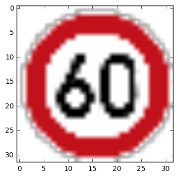
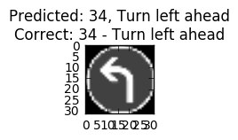

#**Traffic Sign Recognition** 

**Build a Traffic Sign Recognition Project**
The goals / steps of this project are the following:
* Load the data set (see below for links to the project data set)
* Explore, summarize and visualize the data set
* Design, train and test a model architecture
* Use the model to make predictions on new images
* Analyze the softmax probabilities of the new images
* Summarize the results with a written report

[//]: # (Image References)

Fig 1: Training data set bar chart
Fig 2: Validation data set bar chart
Fig 3: Test data set bar chart

  : Trainig dataset bar chart
  : Validation dataset bar chart
  : Test datset bar chart

## Rubric Points

 python notebook is attached.

###Data Set Summary & Exploration

####1. This dataset contains traffic signs for Germany. There are three files for train,validation and test. The Goal of this project is to train the model and perform predection for five downloaded Germany traffic signs from internet.

After the dataset loaded, this project used numpy for data summary and used Matplotlib for bar chart and image visulization. The code for this step is contained in the Step 1.1 section IPython notebook.  

I used the pandas library to create dataframe to get Sign name based on class ID. I used numpy for summary calculations

* The size of training set is 34799
* The size of test set is 12630
* The shape of a traffic sign image is 32*32*3
* The number of unique classes/labels in the data set is 43

####2. This project is using matplotlib for exploratory visualization and to get insight of the dataset. The code is in Step 1.1 of code file.

Here is an exploratory visualization of the data set. There are three bar charts displaying relationship between traffic sign label and the counts for train, validation and test dataset.

###Design and Test a Model Architecture

####1. Describe how, and identify where in your code, you preprocessed the image data. What tecniques were chosen and why did you choose these techniques? Consider including images showing the output of each preprocessing technique. Pre-processing refers to techniques such as converting to grayscale, normalization, etc.
This was the most time consuming section of the whole project. After images converted to grayscale using CV2 module they loose depth of 1. For example image convert from 32*32*3 to gray scale will give output of 32*32 not 32*32*1. I tried different techniques:
    - Use cv2.cvtColor function, but this is for one image at a time and might take long time for 34k images and requires loop to process all images.
    - Use matrix multiplication of 32*32*3 into 3*1 = 32*32*1. After applyting this logic, the images were looking fine, but could not get model accuracy beyond 0.70. Finally after spending 4 hours, I dropped this one approach.
    - Found some conversion techinque at: https://en.wikipedia.org/wiki/Grayscale and wrote my own function, code is available at step 1.2: rgb2gray2(rgb), and it worked out good. Input image 32*32*3 output from this function 32*32*1

The code for this step is at Step 1.2  of the IPython notebook.

Here is a example of traffic sign image before and after grayscaling.

Before :

I used Grayscale image because each sign has unique shape and design; and it looks like color doesn't matter for this classification. According to the lesson, we should remove variables that won't impact model.
As a last step, I normalized the image data because we wanted to avoid values which are too large or too small because values that are too large can produce very high output values and can caouse overfitting. We wanted our variables of 0 mean, equal variance and low in values. By applying normalization functions our values are in range of 0-1 and this change will not alter image shape and simple approach.

####2. I used train_test_split function to split training data into training data(80%) and training data validation(20%) using 80-20 rule and code for that is in Step 2.4 section of the notebook. After the split, the size of training set is :
        Train size (27839, 32, 32, 1)
        Train Validate size (6960, 32, 32, 1)

####3. Describe, and identify where in your code, what your final model architecture looks like including model type, layers, layer sizes, connectivity, etc.) Consider including a diagram and/or table describing the final model.

The code for my final model is located in the Step 2.1 cell of the ipython notebook. 

My final model consisted of the following layers:

| Layer         		|     Description	        					| 
|:---------------------:|:---------------------------------------------:| 
| Input         		| 32x32x1 RGB image   							| 
| Convolution 5x5     	| 1x1 stride, Valid padding, outputs 28x28x6 	|
| RELU		
| dropout												|
| Max pooling	      	| 2x2 stride,  outputs 14x14x6  				|
| Convolution 5x5	    | 1x1 stride, Valid padding, output 10x10x16    |
| RELU                  |
| Maxpooling            | 2x2x16
| Fully Connected       | output 400   									|
| RELU                  |
| Fully Connected       | Output 43
| Softmax				|           									|
|						|												|
|						|												|
 

####4. Describe how, and identify where in your code, you trained your model. The discussion can include the type of optimizer, the batch size, number of Epochs and any hyperparameters such as learning rate.
Step 2.4 section is where I trained and validated the model with Adam Optimizer. I tried with different batch size, learning rate, Epoch and hyper parameters(Mean, SD). Setting mean of 1 or Standard deviation of  0.2 gives very inconsistent accuracy, so I decided to use Mean=0, SD=0.1 as default. Here is the summary of different options:
Model training Results( each tooks around 5-10 minute on my laptop):
- Epoch: 10, learning rate=0.001, batch size: 128, no dropout : Accuracy: 0.853
- Epoch: 10, learning rate=0.001, batch size: 128, no dropout : Accuracy: 0.861
- Epoch: 15, learning rate=0.001, batch size: 128, dropout(.75) : Accuracy: 0.898
- Epoch: 20, learning rate=0.002, batch size: 128, dropout(.75) : Accuracy: 0.914
- Epoch: 30, learning rate=0.001, batch size: 128, dropout(.75) : Accuracy: 0.889
- Epoch: 20, learning rate=0.002, batch size: 128, dropout(.75) : Accuracy: 0.901
- Epoch: 27, learning rate=0.002, batch size: 128, dropout(.75) : Accuracy: 0.923

# best Fit: Epoch:27 , Learning rate: 0.002, batch size 256

The code for training model is located in Step 2.4 section of notebook.

To train the model, I used an iterative approach on my laptop. Tried different batch size=(128,256,512), learning rate=(.001,.002,.003) and Epochs(10,15,20,30,50) as mentioned above.

####5. Describe the approach taken for finding a solution. Include in the discussion the results on the training, validation and test sets and where in the code these were calculated. Your approach may have been an iterative process, in which case, outline the steps you took to get to the final solution and why you chose those steps. Perhaps your solution involved an already well known implementation or architecture. In this case, discuss why you think the architecture is suitable for the current problem.
I tried with different batch size, learning rate, Epoch and hyper parameters(Mean, SD). Setting mean of 1 or SD of 2 gives very inconsistent accuracy, so I decided to use Mean=0, SD=1 as default. Here is the summary of different options:
Model training Results:
- Epoch: 10, learning rate=0.001, batch size: 128, no dropout : Accuracy: 0.853
- Epoch: 10, learning rate=0.001, batch size: 128, no dropout : Accuracy: 0.861
- Epoch: 15, learning rate=0.001, batch size: 128, dropout(.75) : Accuracy: 0.898
- Epoch: 20, learning rate=0.002, batch size: 128, dropout(.75) : Accuracy: 0.914
- Epoch: 30, learning rate=0.001, batch size: 128, dropout(.75) : Accuracy: 0.889
- Epoch: 20, learning rate=0.002, batch size: 128, dropout(.75) : Accuracy: 0.901
- Epoch: 27, learning rate=0.002, batch size: 128, dropout(.75) : Accuracy: 0.923

- Looks like learning rate=0.002 and batch size 256 is giving high accuracy rate for training set.
-      Epoch: 30, learning rate=0.002, batch size: 256, dropout(.75) : Accuracy: 0.923

The code for calculating the accuracy of the model is located in the Step 2.5 and 2.6 section the Ipython notebook.

My final model results were:
* training set accuracy of 0.972
* validation set accuracy of  0.896
* test set accuracy of 0.886

If an iterative approach was chosen:
* What was the first architecture that was tried and why was it chosen?
    I choose color images as input(input=3), just wanted to see how it performs, no grayscale, no normalization. It seems it's very slow and accuracy stuck in between 0.15-0.20, finally killed this process and Switched back to Gray Scale and normalization.I tried with LetNet code as it was provied in lab and Acurracy was around .85 for Epoch=20 and batch size=256

* What were some problems with the initial architecture?
  Training validation Accuracy was around 0.85-0.90 and it was very slow to learn with batch size of 256, learning rate=.001. 

* How was the architecture adjusted and why was it adjusted? Typical adjustments could include choosing a different model architecture, adding or taking away layers (pooling, dropout, convolution, etc), using an activation function or changing the activation function. One common justification for adjusting an architecture would be due to over fitting or under fitting. A high accuracy on the training set but low accuracy on the validation set indicates over fitting; a low accuracy on both sets indicates under fitting.

Yes, the initial model was adjusted to learning rate=0.002 and batchsize=128 and after this change the training validation accuracy jumped to 0.972 - which is Good, but when I ran validation and test accuracy they were 0.896 and 0.886. This looks like overfitting so I decided to add a dropout function between layer 1 and layer2, tuned different values for learning rate, Epoch, batch size etc. Trained the model again and after this training probability dropped to 0.93, close to validation and test accuracy.

* Which parameters were tuned? How were they adjusted and why?
As i mentioned above, the following parameters - learning rate; batchsize; mean and Standard deviation and added dropout. This returned high training accuracy as well as closer accuracy between training, validation and test datasets.

* What are some of the important design choices and why were they chosen? 
    -LeNet algorithm and Adam optimzer. This allows various tunning parameters.
    -Added dropout between layer1 and layer 2
    -input image layer depth set to  1 (grayscale)
    -Different combinations for learning rate, Epoch, batch size the training

If a well known architecture was chosen:
* What architecture was chosen?
 Lenet, Adam Optimizer, learning rate=.002, batch size=128, Epoch=30, mean=0, SD=1, Gray Scale image of 32x32

* Why did you believe it would be relevant to the traffic sign application?
This is a classification problem, we need to classify traffic signs(images) into different classes using convolutional nural network. 

* How does the final model's accuracy on the training, validation and test set provide evidence that the model is working well?
 There is still some difference between training validation set's accuracy of 0.97 and test accuracy of 0.886. Since they are close I think this should work.

###Test a Model on New Images

####1. Choose five German traffic signs found on the web and provide them in the report. For each image, discuss what quality or qualities might be difficult to classify.

Here are five German traffic signs that I found on the web:

The images might be difficult to classify because of the resolution. I couldn't find image of size 32x32 over the internet. I downloaded 110*100*4 images and converted them to 32x32 using PIL module. The new pictures are not good in quality.

####2. Discuss the model's predictions on these new traffic signs and compare the results to predicting on the test set. Identify where in your code predictions were made. At a minimum, discuss what the predictions were, the accuracy on these new predictions, and compare the accuracy to the accuracy on the test set (OPTIONAL: Discuss the results in more detail as described in the "Stand Out Suggestions" part of the rubric).

The code for making predictions on my final model is located in the Step 3.3 section of Ipython notebook.

Here are the results of the prediction:

Predicted: 35, Ahead only
Correct: 35 - Ahead only

Predicted: 28, Children crossing
Correct: 28 - Children crossing

Predicted: 17, No entry
Correct: 17 - No entry

Predicted: 2, Speed limit (50km/h)
Correct: 3 - Speed limit (60km/h)

Predicted: 34, Turn left ahead
Correct: 34 - Turn left ahead

4/5=.80 Accuracy - Code for this section is in Step 3.4 of notebook.

The model was able to correctly guess 4 of the 5 traffic signs, which gives an accuracy of 80%. This is almost near to accuracy on the test set of 0.88. One major cause that I can think of is image resolution.

####3. Describe how certain the model is when predicting on each of the five new images by looking at the softmax probabilities for each prediction and identify where in your code softmax probabilities were outputted. Provide the top 5 softmax probabilities for each image along with the sign type of each probability. (OPTIONAL: as described in the "Stand Out Suggestions" part of the rubric, visualizations can also be provided such as bar charts)

The code for making predictions on my final model is located in the 11th cell of the Ipython notebook.

For the first image, the model is relatively sure that this is a Ahead only(35) sign (probability of 0.60)

Image 1 probability: [ 60.50321579  28.00076103  23.89371109  16.10608482   8.9125967 ] class: [35 12 14 34 33]
Image 2 probability: [ 35.04340744  10.65559769   5.89429665   1.97412419   1.16613042] class: [28  1 11 24 38]
Image 3 probability: [ 97.48392487  21.79851151  20.25235367  12.65798283  11.7533865 ] class: [17 33 14 29 26]
Image 4 probability: [ 31.72658157  17.50898361  11.61895943  10.64897728  10.45840549] class: [ 2  1  4  5 14]
Image 5 probability: [ 18.47331047   9.36174393   9.06409836   7.44846201  -5.44083834] class: [34  1 12 15 38]

For the second image, the model is relatively sure that this is a Children crossing(28) sign (probability of 0.35). 

For the third image, the model is relatively sure that this is a No Entry(17) sign (probability of 0.97). Which is very high- this matches with our result set.

